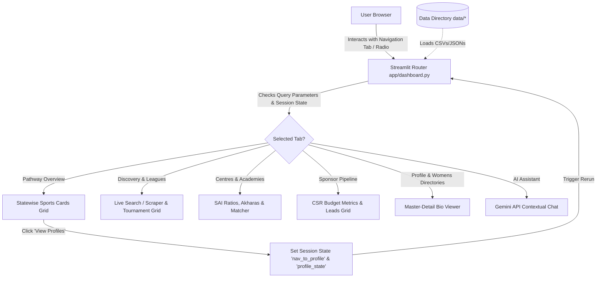
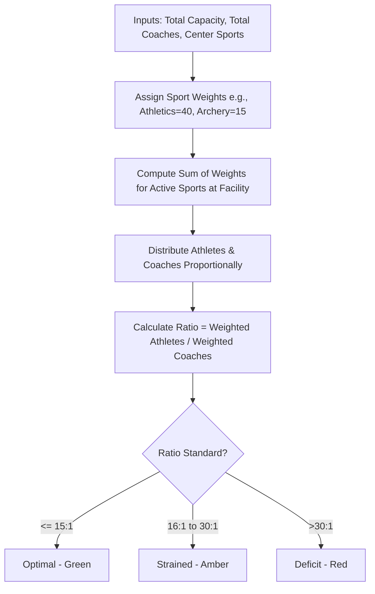

# AthletIQ System Architecture & Documentation

Welcome to the technical documentation for **AthletIQ**, a premium sports intelligence dashboard. This document covers the architecture, user experience styling, data models, mock data boundaries, and the technical steps required to transition the platform into a real-time production system.

---

## 1. Technology Stack

AthletIQ is built entirely on a modern pythonic data stack, heavily optimized for high-performance frontend delivery and data analytics.

*   **Core Programming Language**: Python 3.10+
*   **Web Application Framework**: Streamlit 1.53+ (delivers a responsive, lightweight, single-page application structure).
*   **Data Manipulation Engine**: Pandas (handles in-memory filtering, merging, and transformations of CSV/JSON datasets).
*   **Data Visualization Engine**: Plotly Express & Plotly Graph Objects (generates interactive charts and data dashboards).
*   **Styling Engine**: Custom CSS Injector (overrides default Streamlit themes to implement a custom premium forest-green, gold, and white brand identity with custom tab structures).
*   **AI Integration**: Google Gemini API via `google-generativeai` (powers the AI assistant with contextual grounding).

---

## 2. System Architecture Workflow

The following Mermaid diagram outlines the global execution flow, showing how user selections, database engines, and frontend styling interact:

---

## 3. Database Schema & Data Sources

The platform runs on structured flat-file databases located in the [data/](file:///Users/mohdali/Desktop/AthletIQ/data) directory. Below is the schema, the classification of data (Real vs. Synthetic), and the replacement plan.

### A. Master Athlete & Coach Database
*   **File Path**: [data/athletiq_master_database.csv](file:///Users/mohdali/Desktop/AthletIQ/data/athletiq_master_database.csv)
*   **Real Data**: Athlete names, sports categories (cleaned at load time to correct spelling duplicates like *Athetics* and *Kho kho*), states, and performance levels are compiled from official national tournament rosters (such as Khelo India Youth Games).
*   **Synthetic/Placeholder Data**: 
    *   `notes` and `achievements` columns contain mock narratives (e.g. *"Olympic gold medalist / National record holder"*) to illustrate qualitative profile cards.
    *   Coach capacities and assignment links are simulated.
*   **Production Replacement**: Connect directly to the **Sports Authority of India (SAI) Central Athlete Registry** or **Khelo India Portal API** database tables.

### B. SAI Centres Database
*   **File Path**: [data/sai_centres_processed.json](file:///Users/mohdali/Desktop/AthletIQ/data/sai_centres_processed.json)
*   **Real Data**: The directory list of training centers, cities, states, and the flagship status represents actual government Sports Authority of India (SAI) training hubs and National Centres of Excellence (NCOE).
*   **Synthetic/Placeholder Data**: 
    *   `capacity` (total athlete intake) and `coaches` (total staff count) are simulated based on average regional facility sizes.
    *   Specific sports allocations at each center are estimated from regional sport focuses.
*   **Production Replacement**: Integrate the official **SAI Facility Directory Database** to fetch verified live athlete enrollment and coach deployment records.

### C. Sponsor Pipeline (CSR Budget Metrics)
*   **File Path**: [data/csr_sponsor_signals.csv](file:///Users/mohdali/Desktop/AthletIQ/data/csr_sponsor_signals.csv)
*   **Real Data**: Corporate entities, industrial sectors, and approximate annual CSR budgets are pulled from corporate disclosures.
*   **Synthetic/Placeholder Data**: 
    *   `contact_potential` status labels (*Hot*, *Warm*, *Cold*) and `engagement_strategy` are mocked to demonstrate a pipeline utility.
*   **Production Replacement**: Integrate a business development CRM API (e.g., Salesforce or HubSpot) tracking real negotiations and active sponsorship pitches.

### D. Emerging Women Athletes Registry
*   **File Path**: [data/women_athletes.json](file:///Users/mohdali/Desktop/AthletIQ/data/women_athletes.json)
*   **Real Data**: None.
*   **Synthetic/Placeholder Data**: 
    *   Contains ~5,000 generated entries used to validate dashboard scalability and performance when rendering master-detail views under high data volume.
*   **Production Replacement**: Replace with a database view filtering the master athlete table for `gender == "Female"`.

---

## 4. Key Algorithmic Components

### A. Coach Capacity & Ratio Insights
To solve the lack of direct sport-specific coach tracking data, the system utilizes a **Sport-Weighted Capacity Allocation Algorithm**:

#### Math Formulation:
For a selected sport \(s\) at a facility with total athletes \(A_{total}\) and total coaches \(C_{total}\):
\[A_s = \max\left(1, \text{int}\left(A_{total} \times \frac{W_{athletes}(s)}{\sum_{i \in \text{sports}} W_{athletes}(i)}\right)\right)\]
\[C_s = \max\left(1, \text{int}\left(C_{total} \times \frac{W_{coaches}(s)}{\sum_{i \in \text{sports}} W_{coaches}(i)}\right)\right)\]
\[\text{Ratio}_s = \frac{A_s}{C_s}\]

### B. Coach Redistribution Engine
When a sport is chosen, the engine scans all other national centers:
1. **Surplus Hub (Ratio < 15:1)**: Suggests moving redundant coaches *out* to centers suffering from a deficit.
2. **Deficit Hub (Ratio > 15:1)**: Suggests pulling available surplus coaches *in* from other centers.
3. **Optimal Hub (Ratio == 15:1)**: Validates that staffing levels are standard and suggests no transfers.

---

## 5. Transition to Production (Replacing Mock Data)

To make this dashboard ready for enterprise/government deployment, follow these migration steps:

| Component | Current Mock Implementation | Production Integration Path |
| :--- | :--- | :--- |
| **Athlete Registry** | Static CSV file in project | Connect via SQL Alchemy to a production **PostgreSQL database** synced with national sports portals. |
| **Coaching Ratios** | Algorithmic Sport Weighting model | Replace the weights mathematical split by linking direct coach rosters containing fields: `assigned_sport` and `facility_id`. |
| **Live Tournaments** | Live search grounded Gemini API + mock scraper | Replace with a dedicated Sports Scraper API (such as **Sportradar**, **API-Sports**, or **RapidAPI Sports**) to pull live matches. |
| **CSR Sponsorships** | CSR budget CSV file | Connect to a live CRM database via **HubSpot / Salesforce REST API**. |
| **Akharas & Private Academies** | Hardcoded Markdown directory list | Create a new relational database table (`private_academies`) and implement an admin dashboard form to allow centers to register online. |
